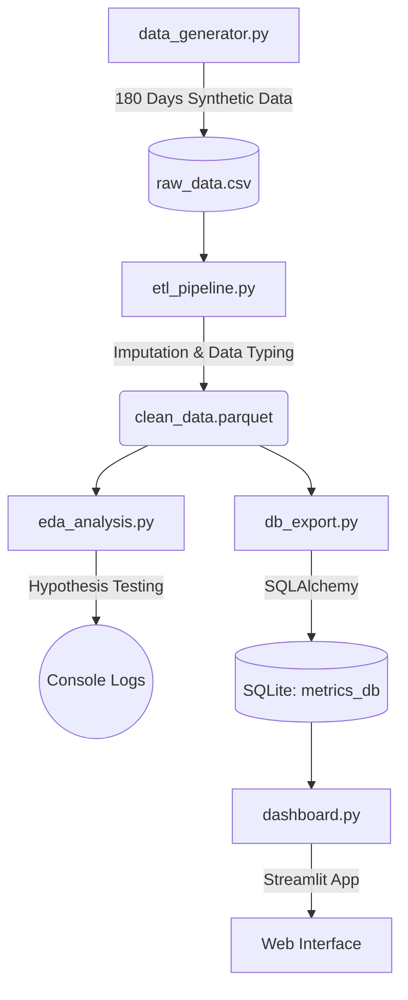

# Fitness data pipeline (ETL & EDA)


Un pipeline analítico de extremo a extremo (End-to-End) diseñado con estándares de **Ingeniería de datos** y **Arquitectura de software** para procesar, limpiar y analizar datos de rendimiento físico y nutricional.

## Problema de negocio y aplicación corporativa

A nivel empresarial (especialmente en industrias como **Salud, Bienestar, Seguros de Vida, IoT y Wearables**), este desarrollo resuelve problemas críticos de toma de decisiones basadas en datos:

### 1. El contexto y origen de los datos
Para emular los retos de un entorno corporativo real, los datos de este proyecto no son un archivo estático perfecto bajado de internet. Son **generados estocásticamente** por el módulo `src/data_generator.py`, usando distribuciones estadísticas para simular el comportamiento humano diario. Esto imita intencionalmente el "ruido", los vacíos y las inconsistencias típicas que enfrentan las empresas cuando recolectan datos de smartwatches, apps de nutrición y sensores IoT en el mundo real.

### 2. La solución (cómo el pipeline resuelve el reto)
*   **Integración de fuentes dispares**: Consolida telemetría de biosensores (horas de sueño), inputs manuales (entrenamiento) y cálculos derivados (calorías) en una única "Fuente de la Verdad".
*   **Garantía de calidad (Data Quality & GIGO)**: Los dispositivos del mundo real fallan o pierden señal. En lugar de descartar filas incompletas (lo cual introduce sesgos), el pipeline ETL emplea **limpieza defensiva**: unifica formatos ISO e imputa datos faltantes (NaN) utilizando técnicas matemáticas como medias móviles de 7 días, garantizando integridad analítica.
*   **Decisiones basadas en evidencia, no en intuición**: Mediante el módulo EDA (Exploratory Data Analysis), el sistema ejecuta pruebas estadísticas rigurosas (Welch's T-Test y correlaciones de Pearson). Esto permite a una empresa saber, por ejemplo, si existe causalidad matemática entre la falta de sueño de los usuarios y una caída en su rendimiento (útil para personalizar recomendaciones o ajustar primas de seguros).
*   **Democratización del dato (BI)**: Finalmente, inyecta los datos refinados en un Data Warehouse relacional (SQLite) y los expone a través de un **Dashboard interactivo**. Esto permite que stakeholders no-técnicos (gerentes, product managers) consuman los insights de forma visual y en tiempo real.

## Arquitectura del proyecto

El flujo se divide en fases orquestadas modularmente, separando la lógica funcional (en `src/`) del almacenamiento de estado (en `data/`).



## Tecnologías y complejidad
- **Eficiencia espacial/temporal**: Todo el pipeline fue diseñado utilizando operaciones vectorizadas (`numpy`, `pandas`) para lograr complejidad temporal **O(1)** a nivel de iterador de Python (O(n) nativo en C), evitando el uso de costosos bucles `for`.
- **Estructura modular**: Implementación de Separation of Concerns (SoC) con `config.py` y `logger.py` unificados.
- **Formato parquet**: Utilizado durante la transición de fases por su alta eficiencia de compresión y preservación de tipos estáticos respecto a formatos planos como CSV.
- **Testing**: Integración continua mediante validación de transformaciones clave con `pytest`.

## Estructura del repositorio

```text
.
├── src/
│   ├── config.py             # Configuración centralizada (paths, variables globales)
│   ├── logger.py             # Instancia estándar de registro (logging)
│   ├── data_generator.py     # Fase 1: Generación de Datos (Genera RAW CSV)
│   ├── etl_pipeline.py       # Fase 2: Limpieza y Casteo (Genera PARQUET)
│   ├── eda_analysis.py       # Fase 3: Pruebas de Hipótesis (Welch T-Test, Pearson/Spearman)
│   ├── db_export.py          # Fase 4: Exportación SQL con SQLAlchemy
│   └── dashboard.py          # Fase 5: Streamlit BI App
├── tests/
│   └── test_etl.py           # Pruebas Unitarias de las transformaciones de Pandas
├── data/                     # Carpeta persistente para Data Lake / Data Warehouse local
├── main.py                   # Orquestador Principal
├── requirements.txt
└── run.bat                   # Ejecutable rápido para Windows
```

## Cómo ejecutar el proyecto

Existen dos formas de desplegar el proyecto: usando contenedores (recomendado para entornos de producción/evaluación) o mediante instalación local clásica.

### Opción A: Despliegue universal con docker (Recomendado) 
Este método garantiza reproducibilidad absoluta, encapsulando dependencias y el sistema operativo. Requiere [Docker](https://www.docker.com/) instalado.

1. **Levantar todos los servicios**:
```bash
docker-compose up -d
```
> *Esto construirá la imagen, ejecutará automáticamente el ETL pipeline y luego levantará el servidor del Dashboard en el puerto 8501.*

2. **Acceder a la aplicación**:
Abre `http://localhost:8501` en tu navegador.

3. **Ejecutar el pipeline de forma aislada** (sin levantar el dashboard continuo):
```bash
docker-compose run --rm etl_pipeline
```
*(Nota: El contenedor persistirá la base de datos resultante en la carpeta local `/data` mediante Volume Mapping).*

---

### Opción B: Instalación local tradicional (Desarrollo)

1. **Instalación**
Crea un entorno virtual e instala las dependencias:
```bash
python -m venv .venv
.\.venv\Scripts\activate
pip install -r requirements.txt
```

### 2. Ejecución del pipeline (ETL + EDA + Base de Datos)
El pipeline completo se puede lanzar desde el entrypoint central:
```bash
python main.py
```
> *Esto generará la data cruda, la limpiará, ejecutará modelos matemáticos para probar correlaciones estadísticas y guardará todo en una base transaccional SQLite.*

### 3. Ejecución de pruebas unitarias (TDD)
Validamos la ingesta usando la suite de test nativa:
```bash
pytest tests/
```

### 4. Lanzar el dashboard (BI)
Para visualizar los datos mediante la aplicación web:
```bash
streamlit run src/dashboard.py
```

---
<p align="center" style="font-size: 12px; color: gray;">
  Desarrollado por <a href="https://github.com/tobidelos" target="_blank" style="font-weight: bold; color: #6366f1;">ttobidelos</a>
</p>

